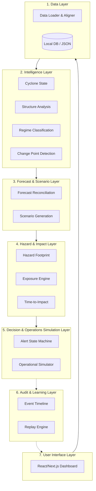

# CYCLONE-OS: ARCHITECTURE SPECIFICATION

## Layer Descriptions & Responsibilities

1. **Data Layer:** Ingestion & temporal alignment of cyclone observations.
2. **Intelligence Layer:** Cyclone state estimation, structure analysis, regime classification, and change point detection.
3. **Forecast & Scenario Layer:** Reconciliation of multi-model NWP guidance and probabilistic scenario generation.
4. **Hazard & Impact Layer:** Parametric wind field modeling, spatial footprint generation, dynamic population exposure calculation, and time-to-impact vectoring.
5. **Decision & Operations Simulation Layer:** Deterministic alert state machine and operational task twin simulation.
6. **Audit & Learning Layer:** Event timeline logger and deterministic replay engine.
7. **User Interface Layer:** Next.js single-pane-of-glass dashboard.
