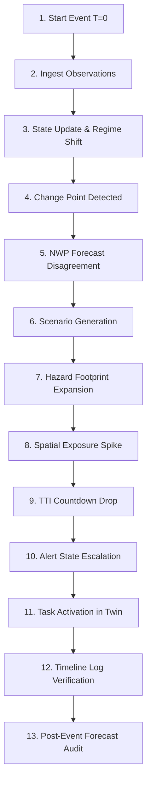

# CYCLONE-OS: DEMO SCRIPT & PITCH GUIDE

## Step-by-Step Presenter Script

1. **Start Event (T=0):**
   > "Judges, standard weather apps show static forecast lines. CYCLONE-OS turns changing atmospheric data into dynamic, actionable decision support. Let me press PLAY on our replay engine."

2. **Regime Shift & CPD (T=5):**
   > "At T=5 hours, our satellite intelligence detects a Change Point: Cyclone Amphan undergoes Rapid Intensification. Notice how NWP forecasts immediately disagree."

3. **Scenarios & Hazard Footprint:**
   > "CYCLONE-OS reconciles this into 3 probabilistic scenarios. Instantly, our spatial hazard model intersects the wind footprint with population maps."

4. **Exposure & Alert State:**
   > "Exposed population jumps to 3.4 Million people, and Time-to-Impact drops to 42 hours. This automatically triggers our Alert State Machine from Yellow to Orange."

5. **Operational Task Activation:**
   > "Notice on the right panel how this automatically deploys simulated NDRF pre-positioning tasks."

6. **Audit & Conclusion:**
   > "Finally, our immutable timeline audits every decision step. CYCLONE-OS doesn't just predict weather—it orchestrates disaster response under uncertainty."
