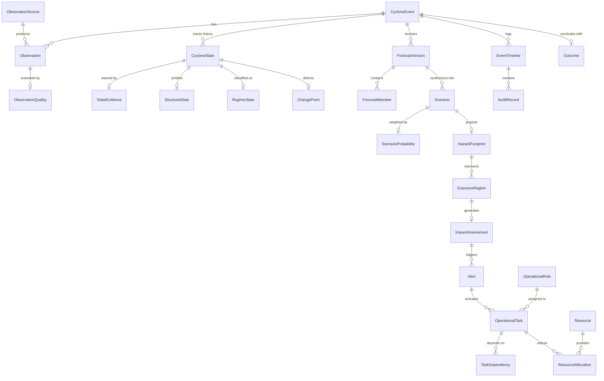

# CYCLONE-OS: FULL ERD SPECIFICATION

```mermaid
erDiagram
    CycloneEvent ||--o{ Observation : "has"
    CycloneEvent ||--o{ CycloneState : "tracks history"
    CycloneEvent ||--o{ ForecastVersion : "receives"
    CycloneEvent ||--o{ EventTimeline : "logs"
    CycloneEvent ||--o| Outcome : "concludes with"
    
    ObservationSource ||--o{ Observation : "produces"
    Observation ||--o| ObservationQuality : "evaluated by"
    
    CycloneState ||--o| StateEvidence : "backed by"
    CycloneState ||--o| StructureState : "exhibits"
    CycloneState ||--o| RegimeState : "classified as"
    CycloneState ||--o| ChangePoint : "detects"
    
    ForecastVersion ||--o{ ForecastMember : "contains"
    ForecastVersion ||--o{ Scenario : "synthesizes into"
    
    Scenario ||--o| ScenarioProbability : "weighted by"
    Scenario ||--o| HazardFootprint : "projects"
    
    HazardFootprint ||--o{ ExposureRegion : "intersects"
    ExposureRegion ||--o| ImpactAssessment : "generates"
    
    ImpactAssessment ||--o{ Alert : "triggers"
    Alert ||--o{ OperationalTask : "activates"
    
    OperationalRole ||--o{ OperationalTask : "assigned to"
    OperationalTask ||--o{ TaskDependency : "depends on"
    OperationalTask ||--o{ ResourceAllocation : "utilizes"
    Resource ||--o{ ResourceAllocation : "provides"
    
    EventTimeline ||--o{ AuditRecord : "contains"
```
