# CYCLONE-OS: 8-HOUR EXECUTION PLAN & GANTT CHART

```mermaid
gantt
    title 8-Hour Hackathon Parallel Work Plan
    dateFormat  HH:mm
    axisFormat %H:%M

    section Member 1 (Frontend)
    UI Skeleton & Layout Setup :00:00, 1h
    MapLibre Integration       :01:00, 2h
    Sidebars & Metrics Cards   :03:00, 2h
    Replay Controls & Timeline :05:00, 2h
    Final UI Polish & Styling  :07:00, 1h

    section Member 2 (Backend & State)
    FastAPI & Pydantic Models  :00:00, 1h
    Replay Engine Core Clock   :01:00, 2h
    Alert Rules & Ops Machine  :03:00, 2h
    Timeline Audit Logging     :05:00, 2h
    End-to-End API Integration :07:00, 1h

    section Member 3 (ML & Forecast)
    Generate Mock JSON Data    :00:00, 1h
    Regime & CPD Logic         :01:00, 2h
    Scenario Generation        :03:00, 2h
    Backend Data Wiring        :05:00, 2h
    Pitch Prep & Rehearsal     :07:00, 1h

    section Member 4 (GIS & Impact)
    GeoJSON & District Setup   :00:00, 1h
    Wind Hazard Polygon Engine :01:00, 2h
    Spatial Population Calc    :03:00, 2h
    Ops Resource Simulation    :05:00, 2h
    Demo Walkthrough Verification:07:00, 1h
```

## Detailed Time-Block Breakdown

- **0:00 - 0:30:** Team contract lock & API schema consensus.
- **0:30 - 1:00:** Workspace setup, data seeding, layout scaffolding.
- **1:00 - 3:00:** Core engine build (MapLibre, Replay clock, Scenario generator, Wind polygon generator).
- **3:00 - 5:00:** Component integration (Sidebars, Alert rules, Spatial population intersection).
- **5:00 - 7:00:** Replay loop integration, timeline logging, and full system connection.
- **7:00 - 8:00:** Demo dry run, pitch rehearsal, bug fixes, offline map verification.
