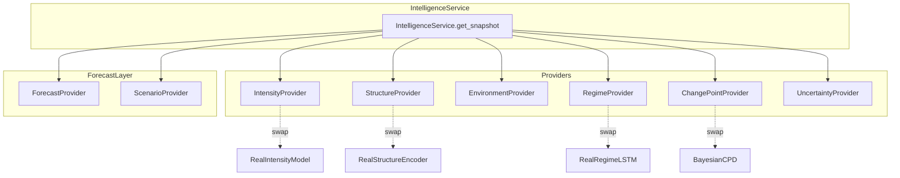

# CYCLONE-OS: ML Intelligence Layer Contract

> **Owner:** Member 3 (ML / Intelligence Architect)
> **Status:** DEMO-READY — All providers return deterministic precomputed outputs.
> **Label:** DEMO INTELLIGENCE LAYER — Mock inference; interfaces designed for real model swap.

---

## Architecture



---

## Provider Interfaces (Abstract)

Every provider implements:

```python
class BaseProvider(ABC):
    @abstractmethod
    def get(self, event_id: str, tick: int) -> BaseModel:
        """Return output for a given event tick."""
        ...
```

### Hackathon Implementation

All providers are `Mock*Provider` classes that index into precomputed JSON arrays by tick number. Zero ML inference at runtime. Deterministic. Reproducible.

---

## Canonical Pydantic Schemas

| Schema | Key Fields | Used By |
|---|---|---|
| `IntensityEstimate` | `value_kt`, `lower_bound`, `upper_bound`, `min_pressure_hpa`, `confidence` | Backend State, Frontend Left Panel |
| `StructureState` | `organization`, `eye_probability`, `symmetry`, `convective_org`, `banding`, `rmw_km`, `confidence` | Backend State, Frontend Analyst View |
| `EnvironmentState` | `sst_c`, `wind_shear_kt`, `mid_level_humidity_pct`, `upper_divergence`, `confidence` | Backend State |
| `RegimeDistribution` | `probabilities: dict[RegimeEnum, float]`, `dominant_regime`, `confidence` | Backend, Frontend Left Panel, Alert Engine |
| `ChangePointEvent` | `detected: bool`, `previous_regime`, `new_regime`, `severity`, `trigger_features`, `confidence` | Backend Timeline, Frontend Alert |
| `UncertaintyState` | `intensity_uncertainty`, `structure_uncertainty`, `regime_uncertainty`, `forecast_spread`, `overall` | Frontend confidence gauges |
| `ForecastMember` | `model_name`, `init_time`, `track: list[TrackPoint]`, `intensity_forecast`, `confidence` | Backend, Map tracks |
| `Scenario` | `scenario_id`, `name`, `probability`, `track`, `cone_geometry`, `intensity_range`, `landfall_region` | Map cones, Right Panel |
| `IntelligenceSnapshot` | All of the above bundled per tick | Backend replay engine |

---

## Demo Event Timeline (12 Ticks)

| Tick | Timestamp | Phase | Intensity (kt) | Regime | CPD | Key Event |
|---|---|---|---|---|---|---|
| 0 | 2020-05-16T00:00Z | Disturbance | 30 | GENESIS | — | Low-pressure detected |
| 1 | 2020-05-16T12:00Z | Genesis | 35 | GENESIS | — | Circulation forming |
| 2 | 2020-05-17T00:00Z | Developing | 45 | DEVELOPING | — | Convection organizing |
| 3 | 2020-05-17T12:00Z | Developing | 55 | DEVELOPING | — | Banding improving |
| 4 | 2020-05-18T00:00Z | Intensifying | 75 | INTENSIFYING | **YES** | RI onset detected |
| 5 | 2020-05-18T12:00Z | Intensifying | 100 | INTENSIFYING | — | Eye forming |
| 6 | 2020-05-19T00:00Z | Intensifying | 125 | INTENSIFYING | — | Eye clear, symmetric |
| 7 | 2020-05-19T12:00Z | Peak | 140 | MATURE | **YES** | Peak intensity reached |
| 8 | 2020-05-20T00:00Z | Mature | 135 | MATURE | — | Slight weakening |
| 9 | 2020-05-20T06:00Z | Approach | 130 | MATURE | — | 12h from landfall |
| 10 | 2020-05-20T10:00Z | Landfall | 110 | WEAKENING | **YES** | Landfall WB coast |
| 11 | 2020-05-20T18:00Z | Dissipation | 60 | WEAKENING | — | Rapid inland weakening |

---

## Integration Points

### For Member 2 (Backend)
```python
from backend.ml.intelligence_service import IntelligenceService

svc = IntelligenceService()
snapshot = svc.get_snapshot("DEMO-001", tick=5)
# Returns IntelligenceSnapshot with all sub-fields populated
```

### For Member 1 (Frontend)
All intelligence data is served via `GET /events/{id}/state` which Member 2 wires to IntelligenceService. Frontend receives JSON matching the schemas above.

### For Member 4 (GIS)
Scenario tracks and cone geometries are in `scenarios.json`. Hazard polygon generation uses `intensity_kt` and `center` from the state to compute wind radii.

---

## Files Delivered

```
backend/ml/
    __init__.py
    interfaces.py          # Abstract base classes
    schemas.py             # All Pydantic models
    mock_intensity.py      # Precomputed intensity provider
    mock_structure.py      # Precomputed structure provider
    mock_environment.py    # Precomputed environment provider
    mock_regime.py         # Precomputed regime provider
    change_point.py        # Deterministic CPD
    uncertainty.py         # Rule-based uncertainty
    mock_forecast.py       # Static forecast members
    mock_scenario.py       # Deterministic scenario generation
    intelligence_service.py # Unified service facade

demo/ml/
    intelligence_snapshots.json
    intensity_states.json
    structure_states.json
    regime_states.json
    environments.json
    change_points.json
    forecasts.json
    scenarios.json
    analogs.json

tests/
    test_intelligence.py
```
