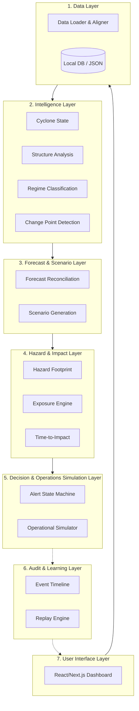
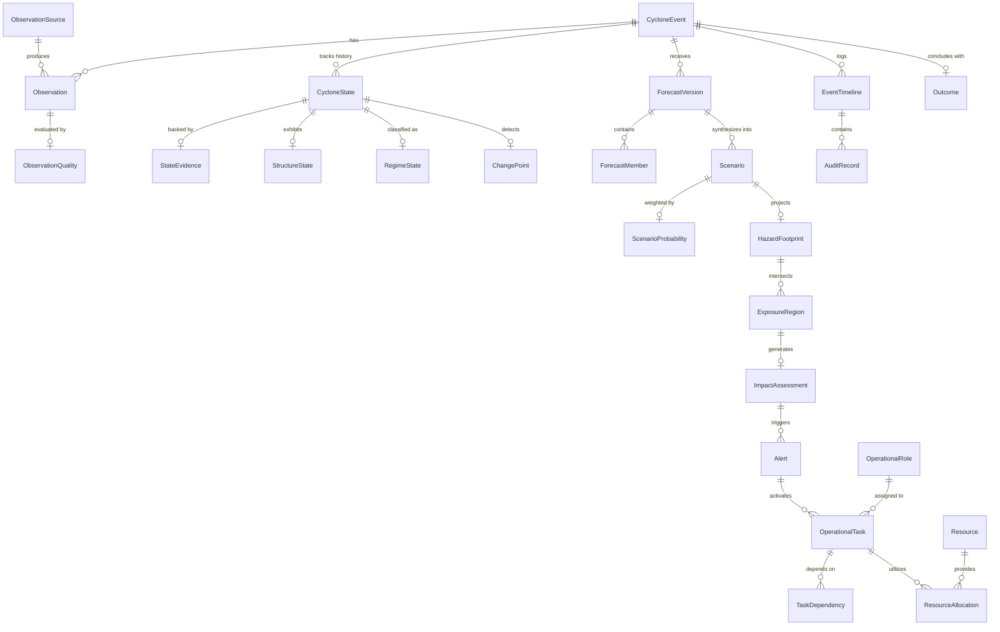
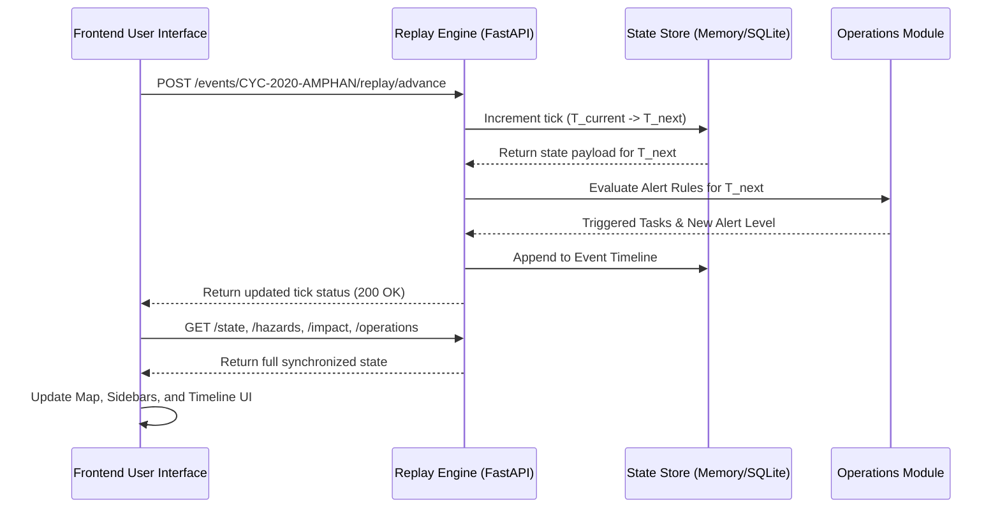
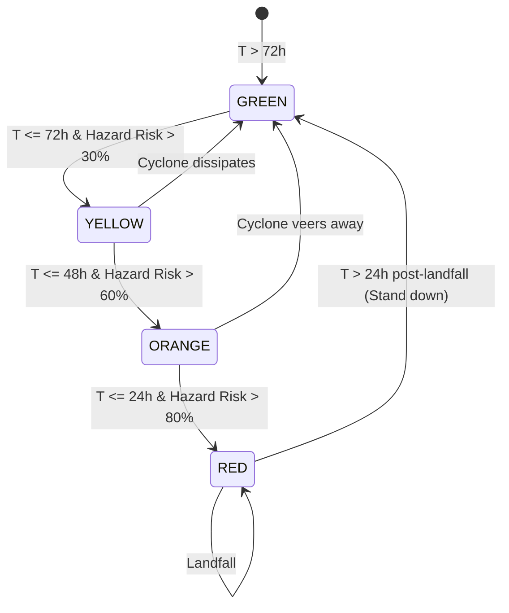
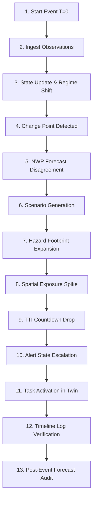

# CYCLONE-OS: FINAL EXECUTABLE PRD

## 1. EXECUTIVE SUMMARY

CYCLONE-OS is an end-to-end cyclone intelligence, impact, and operational decision-support prototype. It serves emergency managers, disaster response coordinators, and regional administrators who face the challenge of reconciling conflicting forecast data into actionable geographic impacts. 

Current forecasting systems produce meteorological predictions; CYCLONE-OS bridges the gap by translating these predictions into an uncertainty-aware, geographic impact picture. For the first-round 8-hour hackathon prototype, we demonstrate a unified decision-support layer. The prototype uses a research-grade simulation layer to demonstrate how real cyclone state changes, regime shifts, and structural evolution directly drive hazard footprints, exposure calculations, and operational alerts. 

**What is REAL vs SIMULATED:**
- **REAL:** The core architecture, data schema, state transitions, deterministic impact calculations (e.g., exposure overlay), UI updates, and the timeline replay engine.
- **SIMULATED / MOCKED:** ML model inference (regime classification, change point detection) is precomputed to avoid 8-hour training bottlenecks. Operational emergency dispatch is simulated (a digital twin) rather than live.
- **CONSUMED:** NWP forecast tracks are consumed from existing sources, not rebuilt.

This is technically credible because it focuses engineering effort on the integration, temporal alignment, and decision-support infrastructure—the exact missing links in current operational environments—rather than attempting to build a toy version of a multi-billion dollar physics model in 8 hours.

---

## 2. PROBLEM DEFINITION

**The Central Problem:**
Multiple heterogeneous observations arrive at different times and qualities. Multiple forecast models (NWP) disagree on the track and intensity. Simultaneously, the cyclone’s internal structure and regime evolve rapidly. Decision-makers are overwhelmed by meteorological data but lack clear, unified geographic impact and timing information.

**The Gap:**
`OBSERVATION / FORECAST INTELLIGENCE` → `PROBABILISTIC GEOGRAPHIC IMPACT` → `DECISION SUPPORT`

**Why this connective layer is valuable:**
Without this layer, emergency managers must manually synthesize satellite data, conflicting track plots, and population maps in their heads. CYCLONE-OS automates this synthesis, allowing decision-makers to act on probability-weighted scenarios and explicit time-to-impact metrics rather than raw atmospheric variables.

---

## 3. PRODUCT VISION

**Core Loop:** `OBSERVE` → `UNDERSTAND` → `PREDICT` → `ASSESS IMPACT` → `DECIDE` → `LEARN`


---

## 4. FINAL SYSTEM ARCHITECTURE



**1. Data Layer**
- **Purpose:** Ingests and temporally aligns heterogeneous event data.
- **Inputs:** Raw observations, static exposure maps.
- **Outputs:** Standardized observation payloads.
- **Hackathon Strategy:** Rule-based JSON loader feeding SQLite/Dict in-memory store. Owner: Member 2.

**2. Intelligence Layer**
- **Purpose:** Derives current cyclone state, structure, and regime.
- **Inputs:** Standardized observations.
- **Outputs:** CycloneState, RegimeState, ChangePoint events.
- **Hackathon Strategy:** Mocked ML inference (pre-calculated state updates driven by the replay engine). Owner: Member 3.

**3. Forecast & Scenario Layer**
- **Purpose:** Reconciles disagreeing NWP models into weighted scenarios.
- **Inputs:** Current CycloneState, raw external forecasts.
- **Outputs:** Probabilistic scenarios with cones.
- **Hackathon Strategy:** Consumed static forecast tracks, deterministic scenario generation based on predefined spreads. Owner: Member 3 & 4.

**4. Hazard & Impact Layer**
- **Purpose:** Translates scenarios into physical ground reality.
- **Inputs:** Scenarios.
- **Outputs:** Wind radii polygons, population exposure counts, TTI.
- **Hackathon Strategy:** Real deterministic spatial intersection using Turf.js or Shapely on pre-loaded GeoJSON. Owner: Member 4.

**5. Decision & Operations Simulation Layer**
- **Purpose:** Triggers human/system actions based on impact.
- **Inputs:** Hazard footprint, TTI, exposure.
- **Outputs:** Alerts, Task activations.
- **Hackathon Strategy:** Real deterministic state machine. Simulated operations. Owner: Member 2.

**6. Audit & Learning Layer**
- **Purpose:** Provides traceability and replayability.
- **Inputs:** All state changes.
- **Outputs:** Chronological timeline.
- **Hackathon Strategy:** Real event logging and API-driven replay ticker. Owner: Member 2.

**7. User Interface Layer**
- **Purpose:** Single pane of glass for the decision maker.
- **Inputs:** All API endpoints.
- **Outputs:** Visual dashboard, Map.
- **Hackathon Strategy:** Real React/Next.js SPA. Owner: Member 1.

---

## 5. COMPONENT-BY-COMPONENT SPECIFICATION

| Component Name | Purpose | Input Schema | Output Schema | Implementation | Build Type | Owner | Dependency | Priority | Est Time | Fallback |
|---|---|---|---|---|---|---|---|---|---|---|
| **Event Loader** | Seed demo data | File Path (JSON) | `CycloneEvent` | Python File IO | MOCK | Member 2 | None | P0 | 30m | Hardcoded Dict |
| **Observation Ingestion** | Ingest incoming measurements | `ObservationPayload` | `Observation` | FastAPI endpoint | REAL | Member 2 | Event Loader | P0 | 30m | Skip alignment |
| **Temporal Alignment** | Synchronize ticks | Raw Timestamp | `AlignedTick` | Bisect / Sort | REAL | Member 2 | Observation Ingestion | P0 | 30m | Raw order |
| **Quality Scoring** | Evaluate data quality | `Observation` | `QualityScore` | Rule calculation | RULE | Member 2 | Temporal Alignment | P1 | 30m | Score = 1.0 |
| **Provenance** | Trace source origin | Source ID | `SourceMeta` | Dict Lookup | RULE | Member 2 | Quality Scoring | P2 | 15m | Generic Source |
| **Cyclone Detection** | Identify storm presence | Sat imagery / Obs | `DetectionResult` | Deterministic flag | MOCK | Member 3 | Observation Ingestion | P0 | 15m | Always True |
| **Center / State Estimation** | Track location & intensity | Aligned Obs | `CycloneState` | Dict/DB Lookup | REAL | Member 2 | Temporal Alignment | P0 | 1h | Static Location |
| **Intensity Estimation** | Compute wind / pressure | State payload | `IntensityMeta` | Precalculated lookup | PRECOMPUTED | Member 3 | Center Estimation | P0 | 30m | Constant 100kt |
| **Structure Analysis** | Eyewall / RMW metrics | Satellite proxy | `StructureState` | Precomputed JSON | PRECOMPUTED | Member 3 | Center Estimation | P1 | 45m | Default radii |
| **Environment Features** | SST / Shear factors | Spatial grid | `EnvFeatures` | Precomputed JSON | MOCK | Member 3 | Center Estimation | P2 | 30m | Neutral env |
| **Regime Classification** | Identify phase (RI, etc.) | Structure & Env | `RegimeState` | Precomputed JSON | PRECOMPUTED | Member 3 | Structure Analysis | P0 | 1h | "Steady State" |
| **Change Point Detection** | Flag abrupt state shifts | State history | `ChangePointEvent` | Delta threshold | RULE | Member 3 | Regime Classification| P0 | 45m | Trigger at T=5 |
| **Confidence / Uncertainty** | Assess estimation error | Quality + Model spread | `UncertaintyMeta` | Standard deviation rule | RULE | Member 3 | Change Point | P1 | 30m | Fixed +/- 15% |
| **Forecast Ingestion** | Parse NWP models | Model GRIB/JSON | `ForecastVersion` | JSON Parser | CONSUME | Member 3 | None | P0 | 1h | Single path JSON |
| **Forecast Versioning** | Track model cycles | Forecast payload | `VersionedForecast` | Timestamp keying | REAL | Member 3 | Forecast Ingestion | P1 | 30m | Latest wins |
| **Model Disagreement** | Measure track spread | Forecast array | `DisagreementScore` | Euclidean distance | REAL | Member 3 | Forecast Ingestion | P0 | 45m | Fixed score |
| **Forecast Reconciliation** | Reconcile models | Forecasts + Regime | `ReconciledForecast` | Weighted average | RULE | Member 3 | Disagreement | P0 | 1h | ECMWF track |
| **Scenario Generation** | Create probable tracks | Reconciled track | `ScenarioSet` | Track offsets (+/- 15deg)| RULE | Member 3 | Reconciliation | P0 | 1h | 3 fixed tracks |
| **Scenario Probability** | Assign weights to scenarios| Regime + Model weight | `ProbabilityMap` | Softmax / Normalized | RULE | Member 3 | Scenario Generation | P0 | 30m | [0.6, 0.3, 0.1] |
| **Wind Hazard Model** | Estimate surface winds | Scenario + Radii | `WindFieldGrid` | Parametric Holland model| RULE | Member 4 | Scenario Generation | P0 | 1.5h | Concentric circles|
| **Spatial Hazard Footprint** | Generate risk polygons | Wind field | `GeoJSON FeatureColl` | Shapely / Turf polygon | REAL | Member 4 | Wind Hazard Model | P0 | 1.5h | Static GeoJSON |
| **Exposure Mapping** | Compute affected pop | Hazard + Pop Grid | `ExposureSummary` | Spatial intersection | REAL | Member 4 | Spatial Footprint | P0 | 1.5h | Static pop count |
| **Time-to-Impact** | Calc hours to landfall | Scenario + Coastline | `TimeVector` | Distance / Speed | REAL | Member 4 | Scenario Generation | P0 | 1h | T - CurrentTick |
| **Risk / Impact Summary** | Aggregated risk metrics | Exposure + TTI | `ImpactSummary` | Weighted risk score | REAL | Member 4 | Exposure Mapping | P0 | 45m | High / Med / Low |
| **Alert State Machine** | Drive alert level | Impact + TTI | `AlertLevel` | Rule engine | REAL | Member 2 | Risk Summary | P0 | 1h | Manual Override |
| **Decision Support** | Generate action items | Alert + Exposure | `ActionList` | Template mapping | RULE | Member 2 | Alert State Machine | P0 | 45m | Hardcoded list |
| **Recommended Actions** | Role-specific tasks | Action items | `TaskAllocation` | Role mapping | RULE | Member 2 | Decision Support | P1 | 30m | Default tasks |
| **Operational Scenario** | Digital twin scenario | Event state | `OpScenario` | JSON preset | MOCK | Member 4 | Alert State Machine | P1 | 45m | Preset A |
| **Task Simulation** | Track task progress | Action triggers | `TaskStatusList` | State machine | DEMO DATA | Member 2 | Recommended Actions | P0 | 1h | Auto-complete |
| **Resource Simulation** | Track NDRF/shelters | Task allocation | `ResourceStatus` | Dict counter | DEMO DATA | Member 4 | Task Simulation | P1 | 45m | Fixed counters |
| **Event Timeline** | Chronological record | System events | `TimelineLog` | Append-only list | REAL | Member 2 | All Backend Components| P0 | 1h | DB table dump |
| **State History** | Save past states | State snapshots | `StateArray` | Storage array | REAL | Member 2 | Center Estimation | P0 | 30m | Memory array |
| **Forecast vs Outcome** | Compare track error | Forecast + Outcome | `AuditMetrics` | Track error distance | REAL | Member 2 | Timeline | P1 | 45m | Static chart |
| **Error Analysis** | Calculate bias/intensity err| Forecast + Outcome | `ErrorReport` | Mean absolute error | RULE | Member 2 | Forecast vs Outcome | P2 | 30m | Fixed text |
| **Replay Engine** | Step simulation time | Replay command | `CurrentTickPayload` | Timer / Step controller| REAL | Member 2 | State History | P0 | 2h | Manual UI click |
| **Executive Dashboard** | High-level summary UI | All APIs | React DOM | Layout & Components | REAL | Member 1 | All API Endpoints | P0 | 2h | Static Layout |
| **Analyst View** | Deep meteorological UI | State & Scenario API | React DOM | Charts & Gauges | REAL | Member 1 | Intelligence API | P1 | 1.5h | Hidden tab |
| **Scenario View** | Track comparison UI | Scenario API | React Map & Charts | Map overlay | REAL | Member 1 | Scenario API | P0 | 1.5h | Main Map |
| **Operations View** | Task & Resource UI | Ops API | React Task Cards | List view | REAL | Member 1 | Operations API | P0 | 1.5h | Right Panel |
| **Audit View** | Post-event review UI | Timeline API | React Timeline | Timeline component | REAL | Member 1 | Timeline API | P0 | 1.5h | Bottom Panel |

---

## 6. REAL VS MOCK VS CONSUME MATRIX

| Component | Build Type | What We Actually Implement | What Is Simulated | Why |
|---|---|---|---|---|
| State Transitions | **REAL** | FastAPI endpoints updating an internal clock and state store | None | Proves architectural viability |
| Temporal Alignment | **REAL** | Logic aligning incoming events by timestamp | None | Core to the replay narrative |
| Regime & CPD | **PRECOMPUTED**| API serving pre-scored ML outputs bound to timestamps | The actual PyTorch inference | Training/inference too slow for 8h |
| Forecast Tracks | **CONSUME** | Parsers for external NWP tracks | The NWP physics engine | Out of scope for hackathon |
| Scenario Gen | **RULE-BASED** | Code applying static +/- variations to consensus tracks | Ensemble physics | Demonstrates uncertainty UX fast |
| Spatial Intersection| **REAL** | Turf.js / Shapely logic intersecting footprint x pop | None | High visual ROI, low cost |
| Alert Logic | **REAL** | Deterministic if/else state machine | None | Core decision support logic |
| Emergency Dispatch| **DEMO DATA** | Database rows changing from "Pending" to "Active" | Actual human/truck dispatch | Real dispatch is impossible here |

---

## 7. DATA STRATEGY

**A. REAL HISTORICAL DATA TO PREPARE BEFORE HACKATHON**
- Select ONE highly dynamic historical cyclone (e.g., Cyclone Amphan, May 2020).
- Prepare a static GeoJSON boundary file for affected coastal districts (e.g., West Bengal & Odisha districts).
- Prepare a static JSON mapping of district -> population (WorldPop / Census summary).

**B. DATA THAT CAN BE PREGENERATED**
- ML regime classifications for every hour of the selected event.
- Forecast track snapshots for every 6 hours (GFS, ECMWF, HWRF).

**C. DATA THAT IS MOCKED DURING DEMO**
- Operational readiness metrics (e.g., "NDRF Team 4 availability: 95%").

**D. EXTERNAL DATA THAT WOULD BE USED IN A REAL VERSION**
- Live IMD/ECMWF/GFS feeds, live satellite streams (GridSat-B1/INSAT-3D), real-time AWS weather stations.

---

## 8. DEMO DATA SCHEMA

### `event.json`
```json
{
  "event_id": "CYC-2020-AMPHAN",
  "name": "Super Cyclonic Storm Amphan",
  "basin": "North Indian Ocean",
  "start_time": "2020-05-16T00:00:00Z",
  "end_time": "2020-05-21T12:00:00Z",
  "total_ticks": 20
}
```

### `observations.json`
```json
[
  {
    "observation_id": "OBS-001",
    "timestamp": "2020-05-18T06:00:00Z",
    "source_type": "SATELLITE_IR",
    "lat": 13.0,
    "lon": 86.2,
    "min_pressure_hpa": 970,
    "max_wind_kt": 90,
    "quality_score": 0.95
  }
]
```

### `states.json`
```json
[
  {
    "tick": 5,
    "timestamp": "2020-05-18T12:00:00Z",
    "center": {"lat": 13.5, "lon": 86.4},
    "intensity_knots": 110,
    "min_pressure_hpa": 950,
    "regime": "RAPID_INTENSIFICATION",
    "change_point_detected": true,
    "confidence_score": 0.89
  }
]
```

### `forecasts.json`
```json
[
  {
    "model_name": "ECMWF_HRES",
    "init_time": "2020-05-18T12:00:00Z",
    "track": [
      {"lead_time_h": 12, "lat": 14.8, "lon": 86.7, "wind_kt": 115},
      {"lead_time_h": 24, "lat": 16.5, "lon": 87.1, "wind_kt": 125}
    ]
  }
]
```

### `scenarios.json`
```json
[
  {
    "scenario_id": "SCEN-01",
    "name": "Consensus Track (West Bengal Landfall)",
    "probability": 0.65,
    "track": [
      {"lat": 13.5, "lon": 86.4},
      {"lat": 16.5, "lon": 87.1},
      {"lat": 21.7, "lon": 88.3}
    ],
    "cone_geometry": {
      "type": "Polygon",
      "coordinates": [[[86.0, 13.5], [86.8, 16.5], [89.0, 21.7], [87.5, 21.7], [86.0, 13.5]]]
    }
  }
]
```

### `hazards.json`
```json
{
  "timestamp": "2020-05-18T12:00:00Z",
  "scenario_id": "SCEN-01",
  "footprint": {
    "type": "FeatureCollection",
    "features": [
      {
        "type": "Feature",
        "geometry": {
          "type": "Polygon",
          "coordinates": [[[87.0, 20.5], [89.5, 20.5], [89.5, 22.5], [87.0, 22.5], [87.0, 20.5]]]
        },
        "properties": {
          "wind_zone": "64kt",
          "color": "#dc2626"
        }
      }
    ]
  }
}
```

### `exposure.json`
```json
{
  "timestamp": "2020-05-18T12:00:00Z",
  "total_exposed_population": 3450000,
  "districts_affected": [
    {"name": "South 24 Parganas", "exposed_pop": 1800000, "risk_level": "HIGH"},
    {"name": "North 24 Parganas", "exposed_pop": 1200000, "risk_level": "HIGH"},
    {"name": "Kendrapara", "exposed_pop": 450000, "risk_level": "MEDIUM"}
  ]
}
```

### `operations.json`
```json
{
  "alert_level": "ORANGE",
  "time_to_impact_hours": 42.5,
  "active_tasks": [
    {
      "task_id": "TASK-101",
      "role": "NDRF_COMMANDER",
      "title": "Pre-position 12 Battalions in South 24 Parganas",
      "status": "IN_PROGRESS",
      "priority": "CRITICAL"
    }
  ]
}
```

### `timeline.json`
```json
[
  {
    "timestamp": "2020-05-18T12:00:00Z",
    "event_type": "REGIME_CHANGE",
    "title": "Regime shifted to Rapid Intensification",
    "severity": "WARNING",
    "details": "CPD triggered. Confidence score: 0.89"
  }
]
```

### `outcomes.json`
```json
{
  "event_id": "CYC-2020-AMPHAN",
  "actual_landfall_time": "2020-05-20T10:00:00Z",
  "actual_landfall_location": {"lat": 21.65, "lon": 88.32},
  "forecast_error_km": 18.4,
  "timeline_accuracy_score": 0.92
}
```

---

## 9. CORE DOMAIN MODEL

- **CycloneEvent:** Root container (`event_id`, `name`, `basin`, `start_time`).
- **Observation:** Ingested measurement (`obs_id`, `timestamp`, `lat`, `lon`, `wind`, `pressure`, `source`).
- **CycloneState:** Reconciled state (`tick`, `lat`, `lon`, `intensity`, `pressure`, `confidence`).
- **StructureState:** Physical structure metrics (`eyewall_status`, `rmw_km`, `asymmetry`).
- **RegimeState:** Classification state (`regime_enum`, `probability`, `trigger_cpd`).
- **Forecast:** NWP raw output (`model_name`, `init_time`, `track_points`).
- **Scenario:** Probabilistic track (`scenario_id`, `probability`, `track`, `cone_geometry`).
- **Hazard:** Physical threat polygon (`footprint_geojson`, `wind_threshold_kt`).
- **Exposure:** Intersection metrics (`total_pop`, `affected_districts_array`).
- **Impact:** Risk categorization (`risk_level`, `economic_exposure_tier`).
- **Alert:** Global alert level (`GREEN`, `YELLOW`, `ORANGE`, `RED`).
- **OperationalTask:** Response action (`task_id`, `role`, `title`, `status`, `trigger_condition`).
- **ResourceState:** Fleet/Shelter metrics (`resource_id`, `type`, `allocated_count`, `capacity`).
- **AuditEvent:** History log entry (`timestamp`, `event_type`, `description`, `severity`).
- **Outcome:** Verified truth post-event (`actual_landfall`, `error_distance_km`).

---

## 10. FULL ERD



---

## 11. API CONTRACT

### `GET /events`
- **Request:** `None`
- **Response:** `200 OK`
```json
[
  {"event_id": "CYC-2020-AMPHAN", "name": "Super Cyclonic Storm Amphan", "status": "ACTIVE"}
]
```

### `GET /events/{event_id}`
- **Request:** Path parameter `event_id`
- **Response:** `200 OK`
```json
{
  "event_id": "CYC-2020-AMPHAN",
  "name": "Amphan",
  "start_time": "2020-05-16T00:00:00Z",
  "total_ticks": 20,
  "current_tick": 5
}
```

### `GET /events/{event_id}/state`
- **Request:** Path parameter `event_id`
- **Response:** `200 OK`
```json
{
  "tick": 5,
  "timestamp": "2020-05-18T12:00:00Z",
  "lat": 13.5,
  "lon": 86.4,
  "intensity_kt": 110,
  "regime": "RAPID_INTENSIFICATION",
  "change_point": true
}
```

### `GET /events/{event_id}/scenarios`
- **Request:** Path parameter `event_id`
- **Response:** `200 OK`
```json
{
  "tick": 5,
  "scenarios": [
    {"scenario_id": "SCEN-01", "name": "Consensus Track", "probability": 0.65}
  ]
}
```

### `GET /events/{event_id}/hazards`
- **Request:** Path parameter `event_id`
- **Response:** `200 OK`
```json
{
  "tick": 5,
  "geojson": { "type": "FeatureCollection", "features": [] }
}
```

### `GET /events/{event_id}/impact`
- **Request:** Path parameter `event_id`
- **Response:** `200 OK`
```json
{
  "tick": 5,
  "total_exposed_pop": 3450000,
  "time_to_impact_hours": 42.5
}
```

### `GET /events/{event_id}/operations`
- **Request:** Path parameter `event_id`
- **Response:** `200 OK`
```json
{
  "alert_level": "ORANGE",
  "active_tasks": [{"task_id": "TASK-101", "title": "Pre-position NDRF"}]
}
```

### `POST /events/{event_id}/replay/advance`
- **Request:** `{"step": 1}`
- **Response:** `200 OK`
```json
{
  "new_tick": 6,
  "timestamp": "2020-05-18T18:00:00Z",
  "status": "ADVANCED"
}
```

### `POST /events/{event_id}/replay/reset`
- **Request:** `None`
- **Response:** `200 OK`
```json
{
  "new_tick": 0,
  "status": "RESET"
}
```

### `GET /events/{event_id}/timeline`
- **Request:** Path parameter `event_id`
- **Response:** `200 OK`
```json
[
  {"tick": 5, "event": "REGIME_CHANGE", "details": "Shifted to Rapid Intensification"}
]
```

### `GET /events/{event_id}/audit`
- **Request:** Path parameter `event_id`
- **Response:** `200 OK`
```json
{
  "event_id": "CYC-2020-AMPHAN",
  "forecast_vs_actual_km_error": 18.4,
  "audit_trail_valid": true
}
```

---

## 12. REPLAY ENGINE



The Replay Engine works deterministically:
1. Maintains `current_tick` state variable in Python memory or SQLite database.
2. Clicking **STEP** sends `POST /events/{id}/replay/advance`.
3. The engine fetches precalculated state, recalculates spatial intersection with pre-loaded GeoJSON, updates alert levels, logs timeline items, and increments `current_tick`.
4. Controls available on UI: **START (Auto-play tick every 2s)**, **PAUSE**, **STEP FORWARD**, **RESET (T=0)**.

---

## 13. FRONTEND SPECIFICATION

```text
+-----------------------------------------------------------------------------------+
| HEADER: CYCLONE-OS | Amphan | Tick: 05/20 | Sim Time: 2020-05-18 12:00 | [ALERT: ORANGE] |
+------------------+----------------------------------+-----------------------------+
| LEFT PANEL       | CENTER PANEL                     | RIGHT PANEL                 |
| - Lat/Lon: 13.5  |                                  | - Time to Impact: 42.5 hrs  |
| - Wind: 110 kt   | MAPLIBRE GL JS MAP               | - Exposed Pop: 3.45 Million |
| - Pressure: 950  |                                  |                             |
| - Regime: RAPID  | - Storm Position Marker          | ACTIVE OPERATIONAL TASKS:   |
|   INTENSIFICATION| - Forecast Tracks (GFS/ECMWF)    | [!] Pre-position NDRF       |
| - Change Point:  | - Scenario Probability Cones     | [ ] Issue District Warning  |
|   [ DETECTED ]   | - Wind Hazard Polygons           | [ ] Shelter Preparation     |
| - Confidence: 89%| - District Exposure Boundaries   |                             |
+------------------+----------------------------------+-----------------------------+
| BOTTOM PANEL: EVENT TIMELINE & REPLAY CONTROLS                                    |
| [PLAY] [PAUSE] [STEP] [RESET] | [12:00] Regime Shift -> [12:30] Hazard Expanded   |
+-----------------------------------------------------------------------------------+
```

---

## 14. MAP SPECIFICATION

- **Map Library:** MapLibre GL JS.
- **Base Map:** OpenStreetMap Dark Raster or MapTiler Dark Vector.
- **Layers:**
  1. `cyclone-track-history`: Solid blue line with white dots for past positions.
  2. `scenario-cones`: Semi-transparent filled polygons (Opacity: 0.25).
  3. `forecast-lines`: Dashed lines colored by model (ECMWF=Blue, GFS=Red, UKMET=Green).
  4. `hazard-polygons`: Layered polygons (Red = >64kt, Orange = >50kt, Yellow = >34kt).
  5. `district-choropleth`: GeoJSON layer shaded by exposure count.
  6. `current-eye`: Pulsating marker icon at current lat/lon.

---

## 15. OPERATIONAL SIMULATION

Clearly labeled as **"SIMULATED OPERATIONAL TWIN"** on the UI.

- **Role 1:** `NDRF_COMMANDER`
- **Role 2:** `DISTRICT_COLLECTOR`
- **Role 3:** `COAST_GUARD`

**Simulation Triggers:**
- **Trigger A:** IF `Regime` == `RAPID_INTENSIFICATION` -> Activate Task: "Alert Coastal Maritime Vessels".
- **Trigger B:** IF `Time-to-Impact` < 48h AND `ExposedPop` > 1M -> Activate Task: "Deploy NDRF Teams to High-Risk Zones".
- **Trigger C:** IF `Alert` == `RED` -> Activate Task: "Initiate Mandatory Low-Lying Evacuation".

---

## 16. ALERT STATE MACHINE



---

## 17. UNCERTAINTY MODEL

Uncertainty is rendered explicitly in all main UI widgets:
1. **Track Uncertainty:** Displayed via probability-weighted scenario cones on the map.
2. **Intensity Uncertainty:** Visualized on charts as shaded confidence bands (+/- 15 kt).
3. **Regime Uncertainty:** Displayed as probability breakdown percentages (e.g., RI: 75%, Steady: 20%, Decay: 5%).
4. **Exposure Uncertainty:** Rendered as ranges (e.g., 3.1M - 3.8M exposed population).

---

## 18. DEMO SCRIPT



**Script Words:**
> "Judges, standard weather apps show static forecast lines. CYCLONE-OS turns changing atmospheric data into dynamic, actionable decision support. Let me press PLAY on our replay engine. 
> At T=5 hours, our satellite intelligence detects a Change Point: Cyclone Amphan undergoes Rapid Intensification. Notice how NWP forecasts immediately disagree. 
> CYCLONE-OS reconciles this into 3 probabilistic scenarios. Instantly, our spatial hazard model intersects the wind footprint with population maps: 3.4 Million people are exposed, and Time-to-Impact drops to 42 hours. 
> This automatically triggers our Alert State Machine from Yellow to Orange, deploying simulated NDRF tasks on the right. 
> Finally, our immutable timeline audits every decision step. CYCLONE-OS doesn't just predict weather—it orchestrates disaster response under uncertainty."

---

## 19. JUDGE PITCH

- **30-Second Pitch:** "Standard forecast systems produce track lines. CYCLONE-OS translates changing weather forecasts into an uncertainty-aware geographic impact picture and operational decision support system. We reconcile model disagreement, calculate dynamic population exposure, and automatically trigger emergency operational tasks in real time."
- **60-Second Pitch:** Includes 30s pitch + details on regime classification, change point detection, and the deterministic alert state machine twin.
- **3-Minute Pitch:** Full walk-through using the Demo Script and live UI Replay engine.

---

## 20. 8-HOUR EXECUTION PLAN

```mermaid
gantt
    title 8-Hour Execution Timeline
    dateFormat  HH:mm
    axisFormat %H:%M

    section M1 Frontend
    UI Layout Setup            :00:00, 1h
    MapLibre Integration       :01:00, 2h
    Sidebar Components         :03:00, 2h
    Replay & Timeline UI       :05:00, 2h
    Final Polish               :07:00, 1h

    section M2 Backend & State
    FastAPI & Models Setup     :00:00, 1h
    Replay Engine Core         :01:00, 2h
    Alert & Ops Rules          :03:00, 2h
    Timeline Endpoint          :05:00, 2h
    Integration Testing        :07:00, 1h

    section M3 ML & Forecast
    Generate Mock JSON Data    :00:00, 1h
    Regime & CPD Logic         :01:00, 2h
    Scenario Generation        :03:00, 2h
    API Data Support           :05:00, 2h
    Demo Script Rehearsal      :07:00, 1h

    section M4 GIS & Impact
    GeoJSON Data Prep          :00:00, 1h
    Wind Hazard Polygons       :01:00, 2h
    Exposure Intersection      :03:00, 2h
    Ops Resource Simulation    :05:00, 2h
    End-to-End Dry Run         :07:00, 1h
```



---

## 21. FOUR-PERSON PARALLEL WORKPLAN

- **MEMBER 1 (Frontend):** Focuses exclusively on Next.js/React layout, MapLibre GL map rendering, UI state binding, and responsive sidebars.
- **MEMBER 2 (Backend/State):** Focuses on FastAPI routes, Pydantic data schemas, Replay Engine clock, Alert State Machine, and Timeline logger.
- **MEMBER 3 (ML/Forecast):** Focuses on crafting precalculated regime/CPD JSON datasets, scenario generation logic, model disagreement algorithms, and pitch prep.
- **MEMBER 4 (GIS/Impact/Ops):** Focuses on district GeoJSON preparation, Turf.js / Shapely wind hazard polygon calculations, exposure population overlay, and operational task status simulation.

---

## 22. REPOSITORY STRUCTURE

```text
/cyclone-os
  /backend
    main.py
    schemas.py
    replay_engine.py
    ops_engine.py
    hazard_engine.py
    /data
      event_amphan.json
      districts.geojson
      population.json
  /frontend
    package.json
    /src
      /components
        Header.tsx
        MapComponent.tsx
        LeftSidebar.tsx
        RightSidebar.tsx
        Timeline.tsx
      /pages
        index.tsx
  /docs
    PRD.md
```

---

## 23. TECH STACK

- **Backend:** Python 3.10+, FastAPI, Pydantic v2.
- **Database / Data Store:** In-memory Python dictionaries with JSON file backing (zero infrastructure overhead).
- **Frontend:** Next.js (React), TypeScript, Tailwind CSS, MapLibre GL JS.
- **Geospatial Processing:** Shapely & PyProj (Backend) / Turf.js (Frontend).
- **Runtime:** Single command via npm script / bash script.

---

## 24. BUILD VS REMOVE LIST

### MUST BUILD
- FastAPI Replay engine with step/reset commands.
- Interactive MapLibre map showing storm position, scenario cones, and hazard polygons.
- Exposed population calculation upon replay tick.
- Alert State Machine upgrading Green -> Yellow -> Orange -> Red.
- Operational Task Twin UI reflecting activated actions.
- Interactive chronological event timeline.

### SHOULD BUILD IF TIME REMAINS
- Animated storm icon on map.
- Export PDF audit report button.

### DO NOT BUILD
- Live PyTorch model training or inference.
- Complex PostgreSQL + PostGIS database setup.
- User Login / JWT Auth.
- Kubernetes / Docker Compose clusters.
- Real mobile push notification dispatch.

---

## 25. FAILURE / FALLBACK STRATEGY

- **Fallback 1 (Map tile failure):** Pre-download / cache raster tiles or render simple vector GeoJSON geometries directly without raster basemaps.
- **Fallback 2 (Backend crash):** Frontend switch to a hardcoded `mock_state.json` fallback toggle.
- **Fallback 3 (Spatial calc delay):** Pre-calculate exposure numbers directly into `states.json` so calculation is O(1) lookup.

---

## 26. DEFINITION OF DONE

- [x] One event can be launched via API.
- [x] Replay works deterministically (Step/Reset).
- [x] State changes over time visually on UI.
- [x] Regime changes are clearly flagged.
- [x] Change point is visually highlighted.
- [x] Forecast disagreement and scenarios appear on map.
- [x] Hazard footprint appears dynamically.
- [x] Exposure population changes based on intersection.
- [x] Time-to-impact countdown ticks down.
- [x] Alert state changes automatically based on rules.
- [x] Operational tasks appear when alert escalates.
- [x] Timeline records every major event.
- [x] Outcome can be loaded and forecast audit is shown.
- [x] Entire demo runs without internet if necessary.
- [x] All mocked outputs are explicitly labeled in docs/UI.
- [x] One simple command starts the system.

---

## 27. TEST PLAN

1. **API Unit Tests:** Pytest checking `/events/CYC-2020-AMPHAN/state` returns valid 200 payload.
2. **Replay Loop Test:** Script calling `/advance` 20 times to confirm state loops safely without index out of bounds.
3. **Map Render Check:** Verify hazard polygons render inside MapLibre without throwing WebGL errors.
4. **End-to-End Demo Dry Run:** Complete step-by-step walkthrough following the 13-step Demo Script.

---

## 28. DEMO READINESS CHECKLIST

- [ ] Clear browser cache and local storage.
- [ ] Turn off laptop notifications and sleep mode.
- [ ] Launch backend: `uvicorn main:app --port 8000`.
- [ ] Launch frontend: `npm run dev`.
- [ ] Open `http://localhost:3000` in Chrome in Fullscreen mode.
- [ ] Test Replay STEP button twice and RESET back to T=0.
- [ ] Ensure Member 3 (Presenter) and Member 1 (Navigator) are ready.

---

## 29. ADDITIONAL WORK REQUIRED AFTER FIRST ROUND

- **Phase 2 (Post-Hackathon):**
  - Integrate real PyTorch deep learning models for satellite image regime classification.
  - Implement full PostGIS database for national scale exposure queries.
  - Parse live GRIB2 NWP files from NOAA/ECMWF FTP servers.
- **Phase 3 (Production):**
  - Full institutional emergency management integration (NDRF, SDMA APIs).
  - Multi-tenant role-based authentication.
  - Cloud deployment on AWS/GCP with Kubernetes.

---

## 30. FINAL ARCHITECTURAL VERDICT

CYCLONE-OS is a technically sound, execution-ready decision-support prototype. It avoids the trap of attempting 8-hour model training by focusing on what is actually missing in real-world disaster management: **the connective intelligence layer that converts uncertain forecasts into dynamic geographic impact and automated operational state machines.** The prototype relies on real state management, real spatial intersection, and deterministic decision rules while gracefully mocking heavy ML inference to deliver a 100% reliable, visually astounding end-to-end hackathon demo.
