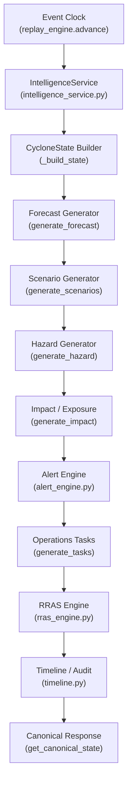

# CYCLONE-OS: PROJECT STATUS AUDIT

**Audit Date:** 2026-09-08  
**Auditor:** Member 3 — Core ML / Intelligence Engineer  
**Repository:** `Soumya080/IIC`  
**Branch:** main  
**Commit verified against:** `13d5b8f`

---

## 1. Executive Summary

CYCLONE-OS is a **deterministic cyclone event replay system** built for hackathon demonstration. The complete backend pipeline — from intelligence snapshot through RRAS allocation — is functional, tested, and deterministic. **39/39 tests pass**, the golden replay runner produces identical output across repeated executions, and the 12-tick Amphan demo event replays end-to-end with full downstream layer population.

The system is currently **MOCK / SYNTHETIC DEMO**. No trained ML models are in production. The architecture is designed for future PyTorch model integration via provider interface swapping.

No frontend exists yet.

---

## 2. Architecture Diagram (Verified)



**Key Architectural Invariant:** `replay_engine.advance()` is the **only** function that mutates `current_tick`. All downstream layers are pure consumers of tick state.

---

## 3. Repository Inventory

### 3.1 Backend Core (backend/)

| File | Lines | Role | Status |
|------|------:|------|--------|
| main.py | 270 | FastAPI bootstrap, SOS/NDRF/resources routes | COMPLETE |
| events.py | 363 | Event/State/Replay/Intelligence API router | COMPLETE |
| replay_engine.py | 846 | Single event clock, 9-layer pipeline, Store | COMPLETE |
| schemas.py | 522 | Pydantic v2 domain models (30+ schemas) | COMPLETE |
| alert_engine.py | 74 | Deterministic GREEN to RED state machine | COMPLETE |
| timeline.py | ~200 | Append-only audit log, forecast skill metrics | COMPLETE |
| providers.py | 191 | Abstract contracts + provider registry | COMPLETE |
| rras_engine.py | 550 | Road network, resource allocation, routing | COMPLETE |
| persistence.py | 147 | SQLite DDL + helpers (SOS, audit, timeline) | COMPLETE |
| seed_data.py | ~200 | Amphan 12-tick seed data + demo resources | COMPLETE |

### 3.2 Intelligence Layer (backend/ml/)

| File | Lines | Role | Status |
|------|------:|------|--------|
| intelligence_service.py | 120 | Unified facade: get_snapshot(event_id, tick) | COMPLETE |
| interfaces.py | 80 | 8 abstract provider interfaces | COMPLETE |
| schemas.py | ~200 | ML-layer Pydantic schemas | COMPLETE |
| mock_intensity.py | ~80 | Precomputed intensity table | MOCK |
| mock_structure.py | ~80 | Precomputed structure table | MOCK |
| mock_environment.py | ~80 | Precomputed environment table | MOCK |
| mock_regime.py | ~80 | Precomputed regime probabilities | MOCK |
| mock_forecast.py | ~120 | Precomputed NWP-style forecasts | MOCK |
| mock_scenario.py | ~150 | Precomputed scenario generation | MOCK |
| change_point.py | ~80 | Deterministic change-point detection | MOCK |
| uncertainty.py | ~80 | Rule-based uncertainty estimation | MOCK |
| real_providers.py | 124 | PyTorch integration stubs (3 providers) | STUB |

### 3.3 Tests (tests/)

| File | Tests | Focus | Status |
|------|------:|-------|--------|
| test_intelligence.py | 10 | ML schemas, determinism, swappability | 10/10 PASS |
| test_backend_integration.py | 3 | T0 state, advance E2E, replay T5 | 3/3 PASS |
| test_golden_replay.py | 8 | Cascade validation, determinism, cross-layer | 8/8 PASS |
| test_rras.py | 18 | RRAS at T0/T5/T9/T10, canonical integration | 18/18 PASS |
| **Total** | **39** | | **39/39 PASS** |

### 3.4 Scripts (scripts/)

| File | Purpose | Status |
|------|---------|--------|
| golden_replay.py | Full T0-T11 replay with determinism verification | EXIT 0 |
| generate_demo_data.py | Exports 9 ML JSON files to demo/ml/ | EXIT 0 |
| validate_12tick_story.py | Story-mode 12-tick narrative validator | EXISTS |
| show_rras_samples.py | RRAS output sampler for inspection | EXISTS |

### 3.5 Demo Data (demo/)

| File | Size | Content |
|------|-----:|---------|
| demo/golden_replay_output.json | 13 KB | Machine-readable golden replay output |
| demo/ml/intelligence_snapshots.json | 165 KB | 12 full intelligence snapshots |
| demo/ml/forecasts.json | 38 KB | 12 tick forecast ensembles |
| demo/ml/scenarios.json | 74 KB | 12 tick scenario sets |
| demo/ml/intensity_states.json | 3.6 KB | Intensity trajectory |
| demo/ml/structure_states.json | 4.2 KB | Structure states |
| demo/ml/regime_states.json | 4.6 KB | Regime distributions |
| demo/ml/environments.json | 3.7 KB | Environmental context |
| demo/ml/change_points.json | 4.2 KB | Change point detections |
| demo/ml/analogs.json | 1.0 KB | Historical analogs |

### 3.6 Documentation (docs/)

| File | Content | Current |
|------|---------|---------|
| ARCHITECTURE.md | 7-layer Mermaid diagram | Accurate |
| GOLDEN_REPLAY.md | Master replay specification | Accurate |
| ML_CONTRACT.md | Provider interface spec | Accurate |
| ML_INTEGRATION.md | Intelligence-to-Backend integration guide | Accurate |
| ML_ROADMAP.md | Future ML training plan | Accurate |
| PRD.md | Full product requirements | Reference |
| ERD.md | Entity relationship diagram | Reference |
| EXECUTION_PLAN.md | Original execution plan | Reference |
| DEMO_SCRIPT.md | Demo pitch script | Reference |

### 3.7 Other Top-Level Files

| Item | Nature |
|------|--------|
| RRAS/ | Standalone RRAS sub-project (separate git repo). NOT integrated into main pipeline; rras_engine.py in backend/ is canonical |
| artifacts/ | Problem decomposition / brainstorming artifacts from IIC 3.0 |
| data.json, extract.py, extract.js, index.js | Pre-hackathon data extraction utilities |

---

## 4. Component Status Classification

### 4.1 Pipeline Layers

| # | Layer | Module | Status | Notes |
|---|-------|--------|--------|-------|
| 1 | Event Clock | replay_engine.advance() | PRODUCTION-READY | Single source of tick mutation |
| 2 | Intelligence | intelligence_service.py | MOCK COMPLETE | 8 providers, deterministic, swappable |
| 3 | State Builder | replay_engine._build_state() | PRODUCTION-READY | Merges intelligence + seed data |
| 4 | Forecast | replay_engine.generate_forecast() | MOCK COMPLETE | 4-model ensemble, T11 handling |
| 5 | Scenarios | replay_engine.generate_scenarios() | MOCK COMPLETE | BASE/LEFT/RIGHT + RI detection |
| 6 | Hazard | replay_engine.generate_hazard() | MOCK COMPLETE | Parametric Holland, 34/50/64kt zones |
| 7 | Impact/Exposure | replay_engine.generate_impact() | MOCK COMPLETE | Population, TTI, risk, flood index |
| 8 | Alert | alert_engine.py | PRODUCTION-READY | GREEN-YELLOW-ORANGE-RED state machine |
| 9 | Operations | replay_engine.generate_tasks() | MOCK COMPLETE | TTI/regime-driven task generation |
| 10 | RRAS | rras_engine.py | MOCK COMPLETE | 23-node road network, Dijkstra routing |
| 11 | Timeline/Audit | timeline.py | PRODUCTION-READY | Append-only log, forecast skill metrics |
| 12 | Canonical Response | replay_engine.get_canonical_state() | PRODUCTION-READY | Full unified state at any tick |

### 4.2 API Endpoints (30 total, all operational)

| Endpoint | Method | Status |
|----------|--------|--------|
| /api/v1/health | GET | OK |
| /api/v1/demo/seed | POST | OK |
| /api/v1/events | GET/POST | OK |
| /api/v1/events/{id} | GET | OK |
| /api/v1/events/{id}/state | GET | OK |
| /api/v1/events/{id}/track | GET | OK |
| /api/v1/events/{id}/forecasts | GET | OK |
| /api/v1/events/{id}/scenarios | GET | OK |
| /api/v1/events/{id}/hazards | GET | OK |
| /api/v1/events/{id}/impact | GET | OK |
| /api/v1/events/{id}/operations | GET | OK |
| /api/v1/events/{id}/timeline | GET | OK |
| /api/v1/events/{id}/audit | GET | OK |
| /api/v1/events/{id}/audit/forecast-skill | GET | OK |
| /api/v1/events/{id}/outcome | GET | OK |
| /api/v1/events/{id}/advance | POST | OK |
| /api/v1/events/{id}/replay/advance | POST | OK |
| /api/v1/events/{id}/replay/start | POST | OK |
| /api/v1/events/{id}/replay/reset | POST | OK |
| /api/v1/events/{id}/replay/goto | POST | OK |
| /api/v1/events/{id}/canonical | GET | OK |
| /api/v1/events/{id}/intelligence | GET | OK |
| /api/v1/sos | GET/POST | OK |
| /api/v1/sos/{id} | GET | OK |
| /api/v1/sos/{id}/status | PATCH | OK |
| /api/v1/ndrf-alerts | GET | OK |
| /api/v1/resources | GET | OK |
| /api/v1/resources/gap | GET | OK |
| /api/v1/districts | GET | OK |
| /api/v1/districts/{district}/readiness | GET | OK |

---

## 5. Test Results (Verified 2026-09-08)

```
============================= 39 passed, 2 warnings in 1.76s =============================
```

### 5.1 Test Breakdown

| Suite | Tests | Result | Coverage |
|-------|------:|--------|----------|
| test_intelligence.py | 10 | ALL PASS | Schema validation, determinism, swappability |
| test_backend_integration.py | 3 | ALL PASS | T0 state, advance E2E, replay progression |
| test_golden_replay.py | 8 | ALL PASS | Full cascade, determinism, cross-layer, reset |
| test_rras.py | 18 | ALL PASS | T0/T5/T9/T10 states, canonical integration |
| **Total** | **39** | **ALL PASS** | |

### 5.2 Golden Replay Verification

```
DETERMINISM VERIFIED: Run 1 and Run 2 match 100% identically across all 12 ticks.
```

### 5.3 Demo Data Generation

```
Generated 9 files in demo/ml (exit code 0)
```

### 5.4 Warnings (Non-blocking)

| Warning | Severity | Action Required |
|---------|----------|-----------------|
| on_event deprecation in FastAPI | LOW | Migrate to lifespan event handlers when convenient |

---

## 6. Real vs. Synthetic Classification

> **CAUTION: ALL intelligence outputs are SYNTHETIC / MOCK. No trained ML model produces any output in the current system. Every disclaimer in the codebase is accurate.**

| Component | Classification | Data Source |
|-----------|---------------|-------------|
| Intelligence (intensity, structure, regime, etc.) | SYNTHETIC | Precomputed tables derived from IBTrACS |
| Forecasts | SYNTHETIC | Parametric 4-model ensemble with fixed offsets |
| Scenarios | SYNTHETIC | Probability-weighted lateral perturbations |
| Hazard footprints | SYNTHETIC | Simplified Holland parametric wind field |
| Population exposure | SYNTHETIC | Precomputed per-tick lookup table |
| RRAS road network | SYNTHETIC | 23-node hand-curated Bay of Bengal graph |
| RRAS allocation | SYNTHETIC | Heuristic rule-based allocation |
| Alert transitions | DETERMINISTIC | TTI + composite risk thresholds |
| Change-point detection | SYNTHETIC | Fixed at T4, T7, T10 |
| Historical analogs | STATIC | 3 hard-coded North Indian Ocean storms |
| SOS / NDRF | SIMULATED | User-submitted demo reports |

---

## 7. Frontend Readiness Checklist

The backend exposes everything the frontend needs through a single endpoint:

```
GET /api/v1/events/{id}/canonical?tick=N
```

### 7.1 Data Available for Frontend Consumption

| Frontend Panel | Backend Source | Data Fields |
|---------------|---------------|-------------|
| Map / Track | canonical.state, canonical.hazards | lat/lon, GeoJSON zones, track history |
| Intensity Gauge | canonical.state.intensity_kt | wind speed, pressure, uncertainty |
| Regime Badge | canonical.state.regime | lifecycle phase + probabilities |
| Forecast Cone | canonical.forecasts | 4-model ensemble + consensus track |
| Scenario Cards | canonical.scenarios | BASE/LEFT/RIGHT with probabilities |
| Hazard Zones | canonical.hazards.zones | 34/50/64kt GeoJSON polygons |
| Exposure Panel | canonical.impact | population, districts, TTI, risk |
| Alert Banner | canonical.alert | level, triggers, previous level |
| Operations List | canonical.operations | tasks with priority, role, district |
| RRAS Dashboard | canonical.rras | roads, allocation, routing |
| Timeline Feed | canonical.timeline | chronological event log |
| Replay Controls | advance, reset, goto | tick navigation |

### 7.2 Frontend Blockers

| Item | Status | Notes |
|------|--------|-------|
| REST API | READY | All 30 endpoints operational |
| CORS | ENABLED | allow_origins=["*"] |
| JSON serialization | WORKING | Pydantic v2 model_dump(mode="json") |
| WebSocket / SSE | NOT BUILT | Not required for MVP; replay is request-driven |
| Authentication | NOT BUILT | Not required for hackathon demo |

---

## 8. ML Readiness Classification

### 8.1 Integration Architecture

```
Current:  MockProvider.get(event_id, tick)  ->  precomputed table lookup
Future:   RealProvider.get(event_id, tick)  ->  torch.load(model) -> inference
```

Swap mechanism: Change one line in IntelligenceService.__init__() per provider.

### 8.2 Provider Readiness

| Provider | Mock | Interface | Real Stub | Training Data | Model |
|----------|:----:|:---------:|:---------:|:-------------:|:-----:|
| Intensity | YES | YES | YES | NO | NO |
| Structure | YES | YES | YES | NO | NO |
| Regime | YES | YES | YES | NO | NO |
| Environment | YES | YES | -- | NO | NO |
| Change Point | YES | YES | -- | NO | NO |
| Uncertainty | YES | YES | -- | NO | NO |
| Forecast | YES | YES | -- | NO | NO |
| Scenario | YES | YES | -- | NO | NO |

### 8.3 What Is Needed for Real ML

1. **Training data pipeline**: IBTrACS + INSAT-3DR satellite imagery alignment
2. **Model training**: CNN-LSTM or ViT for intensity; HMM/Transformer for regime
3. **Model artifacts**: .pt checkpoint files in models/ directory
4. **Inference wrapper**: Implement get() method in real provider classes
5. **No downstream changes required**: Schema contracts are stable

---

## 9. Known Issues and Technical Debt

| # | Issue | Severity | Impact |
|---|-------|----------|--------|
| 1 | on_event("startup") deprecation warning | LOW | Cosmetic; migrate to lifespan pattern |
| 2 | datetime.utcnow() deprecation in some schema defaults | LOW | Replace with datetime.now(timezone.utc) |
| 3 | In-memory Store not persisted across restarts | MEDIUM | Acceptable for hackathon; need Redis/DB for production |
| 4 | No rate limiting on API | LOW | Not needed for demo |
| 5 | RRAS/ subproject not integrated | INFO | Standalone prototype; rras_engine.py is canonical |
| 6 | No error recovery on partial pipeline failure | MEDIUM | Pipeline returns 502 with layer name; no partial state recovery |

---

## 10. Reordered Roadmap

### Phase 1: Frontend MVP (NEXT -- for hackathon demo)

1. Initialize Next.js/Vite project
2. Map component: Leaflet/Mapbox with GeoJSON hazard overlays
3. Replay controls: advance / reset / goto tick slider
4. Status panels: intensity gauge, regime badge, alert banner
5. Exposure summary card
6. Operations list
7. Timeline feed
8. Connect all panels to GET /canonical?tick=N

### Phase 2: Demo Polish (hackathon day-of)

1. RRAS dashboard panel (road status map + allocation table)
2. Forecast cone visualization
3. Scenario comparison cards
4. SOS submission form + NDRF alert display
5. Auto-advance animation mode (tick every N seconds)
6. Dark theme + micro-animations

### Phase 3: Post-Hackathon ML Integration

1. Collect IBTrACS + satellite paired training data
2. Train intensity estimator (CNN-LSTM)
3. Train regime classifier (HMM/Transformer)
4. Swap mock to real providers (1 line each)
5. Calibrate uncertainty quantification
6. Validate against holdout cyclone events

### Phase 4: Production Hardening

1. Persistent state (Redis or PostgreSQL)
2. WebSocket/SSE for live updates
3. Authentication + rate limiting
4. Multi-event support
5. Real-time data ingestion (IMD bulletins)
6. Lifespan event handler migration

---

## 11. Verification Commands

```bash
# Run full test suite (39 tests)
python -m pytest tests/ -v

# Run golden replay with determinism check
python scripts/golden_replay.py

# Generate demo ML data files
python scripts/generate_demo_data.py

# Start backend server
cd backend && uvicorn main:app --reload --port 8000

# Verify API health
curl http://localhost:8000/api/v1/health

# Advance one tick
curl -X POST http://localhost:8000/api/v1/events/DEMO-001/advance

# Get canonical state at tick 5
curl http://localhost:8000/api/v1/events/DEMO-001/canonical?tick=5
```

---

*This audit reflects the verified state of the repository as of 2026-09-08. All test results were obtained by actual execution, not documentation claims.*
